# ⚡ Real-time E-commerce Lakehouse

**Kafka → Flink SQL → Apache Iceberg → Trino → Streamlit, on your laptop with one command.**

**Lakeshop**, a real demo storefront with search, a cart and fake checkout, streams every click and
order into Kafka (an optional simulator can add background traffic). Flink SQL turns them into
exactly-once Apache Iceberg tables on S3-compatible storage. Trino queries those tables, and a live
dashboard shows revenue, the conversion funnel and top products, plus the lakehouse internals
(snapshots, small files, compaction, time travel) that usually stay hidden.

<table>
  <tr>
    <td width="50%">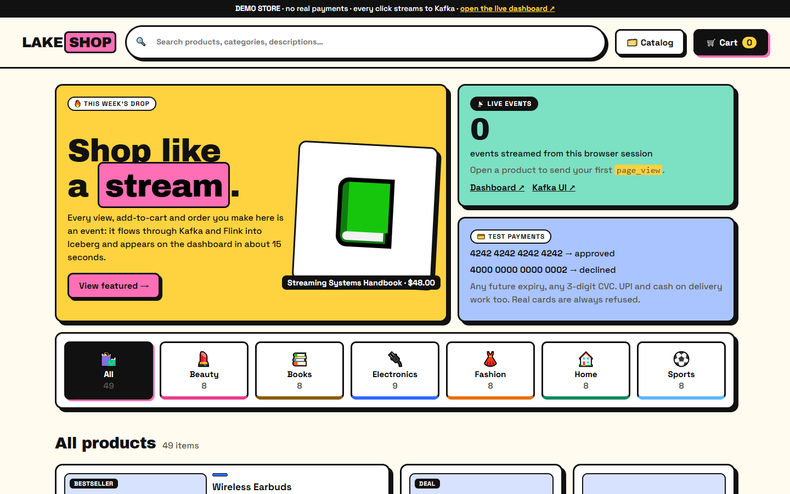<br><sub><b>🛒 Lakeshop</b>: shop here, every click is an event</sub></td>
    <td width="50%">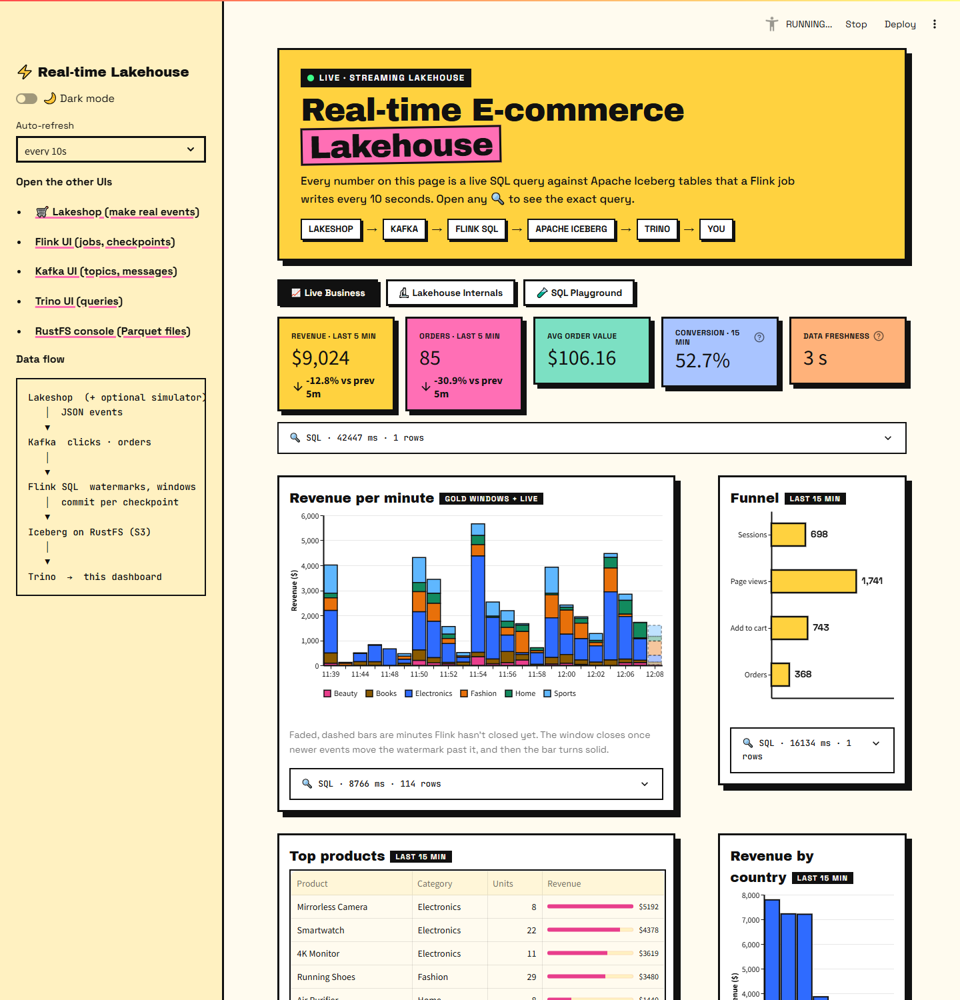<br><sub><b>📊 Dashboard</b>: the same events, about 15 s later, from Iceberg</sub></td>
  </tr>
</table>

**▶ Want the guided version?** [docs/DEMO.md](docs/DEMO.md) is a 10-minute click-by-click demo with screenshots.

---

## Screenshots

| Browse (bento grid) | Product | Cart |
|---|---|---|
|  | 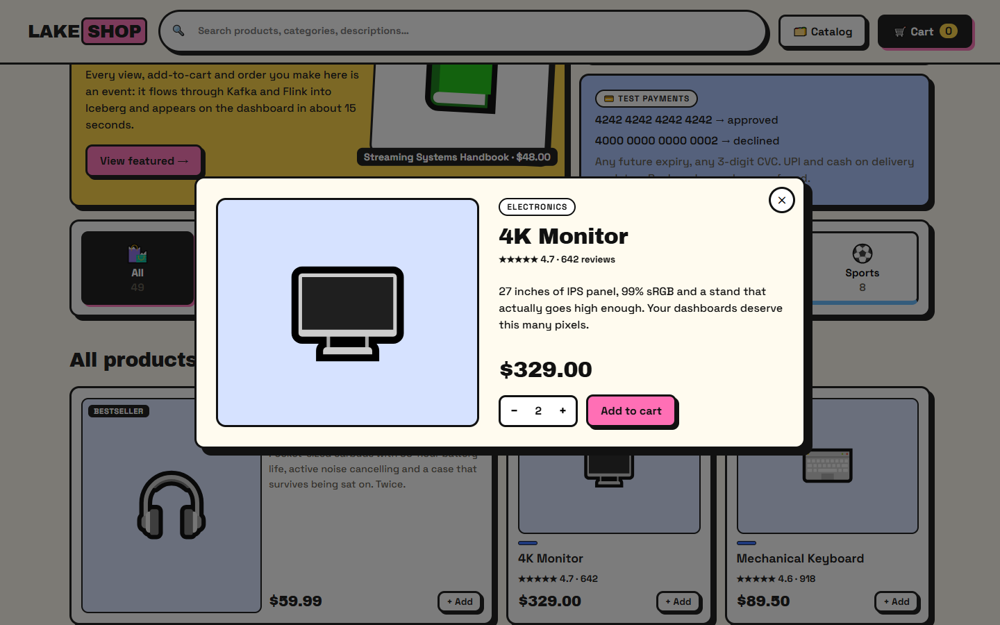 | 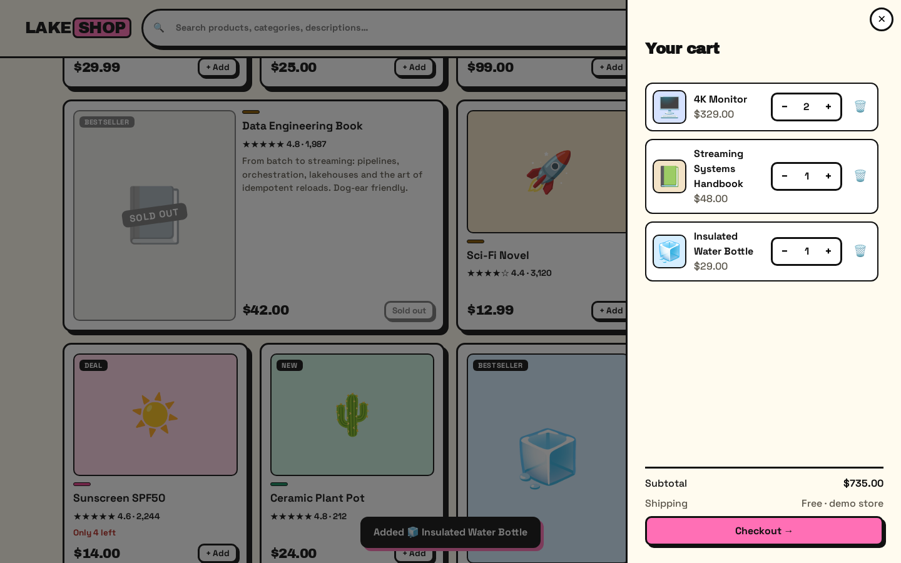 |
| **Test-mode checkout** | **Declined card: no order event** | **Order placed** |
| 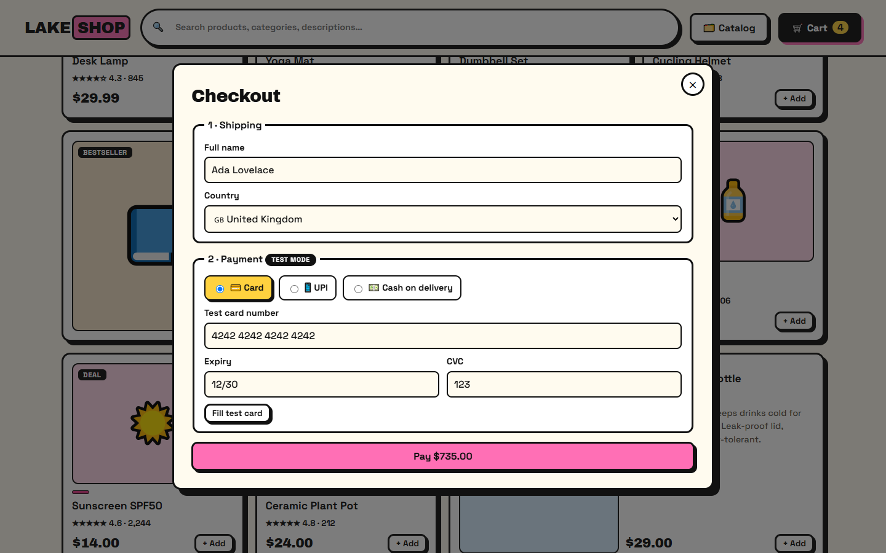 | 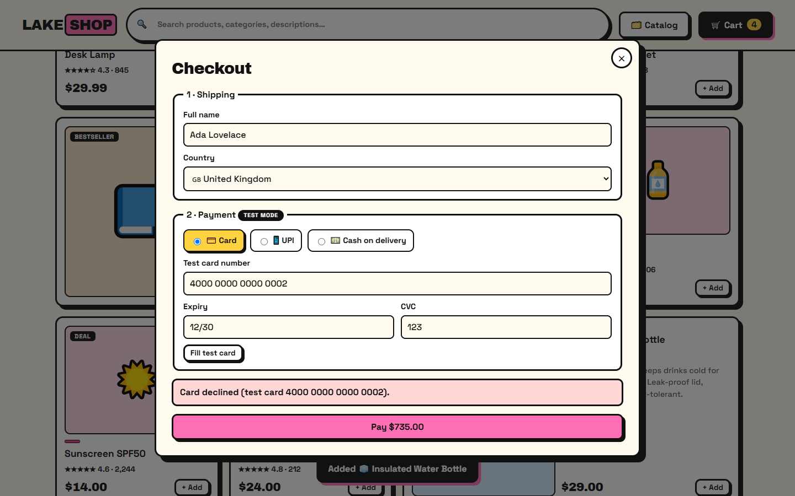 | 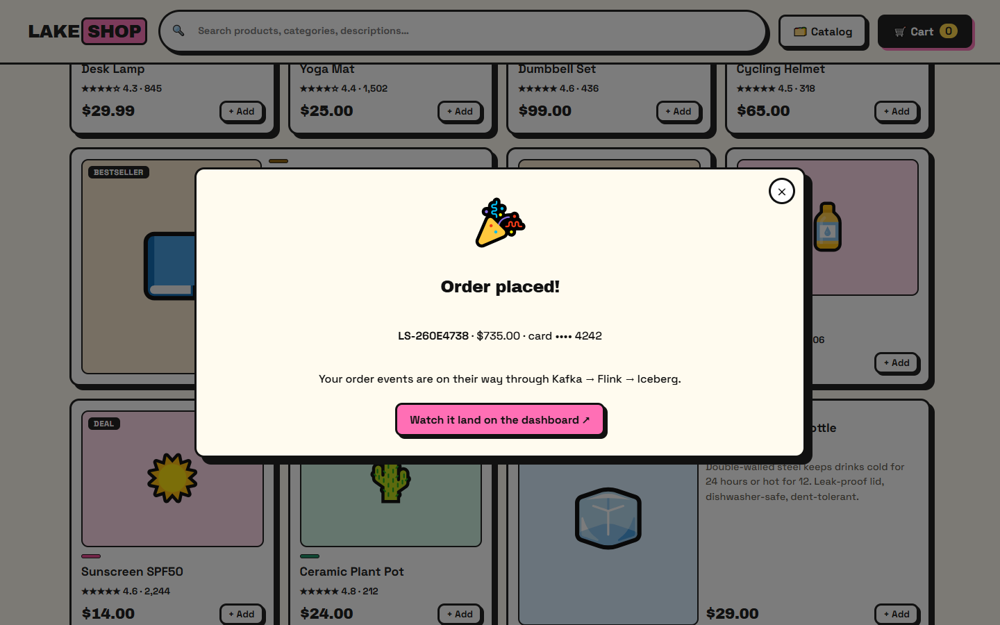 |
| **Dashboard, dark mode** | **Lakehouse internals** | **SQL playground** |
| 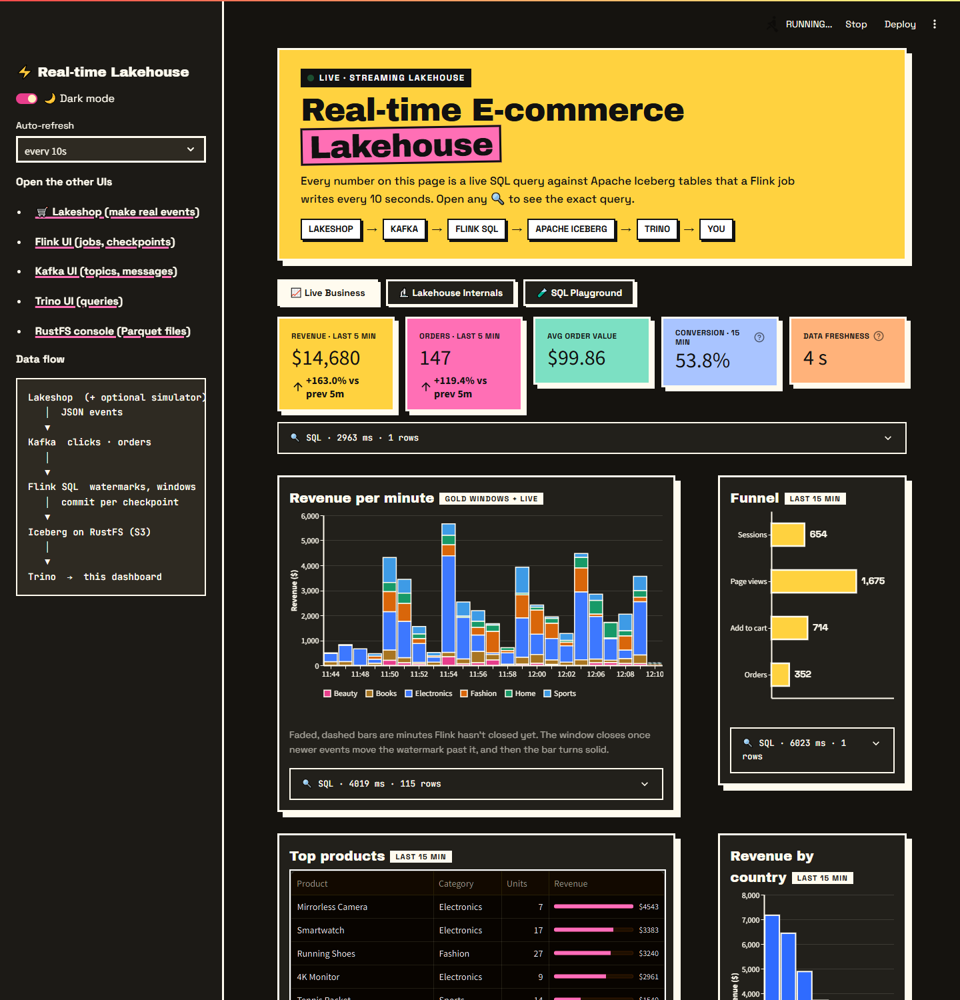 | 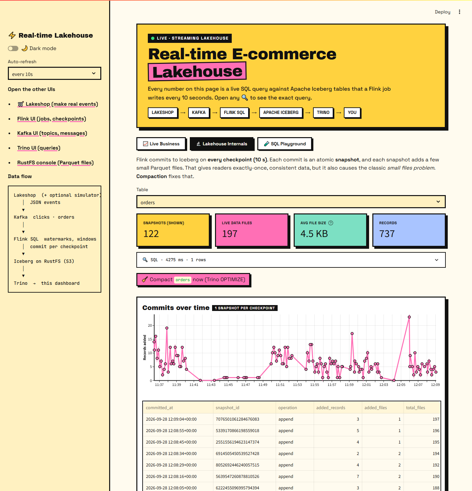 | 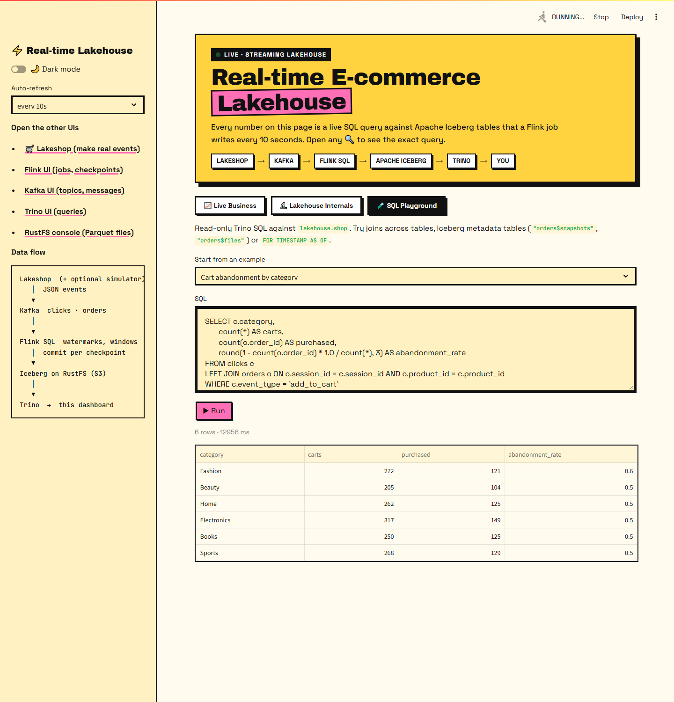 |
| **Catalog admin** | **Add a product (emoji picker + live preview)** | **Mobile store** |
| 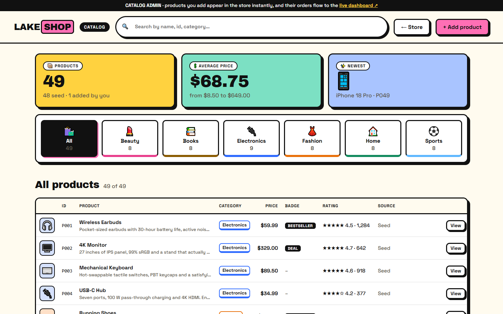 | 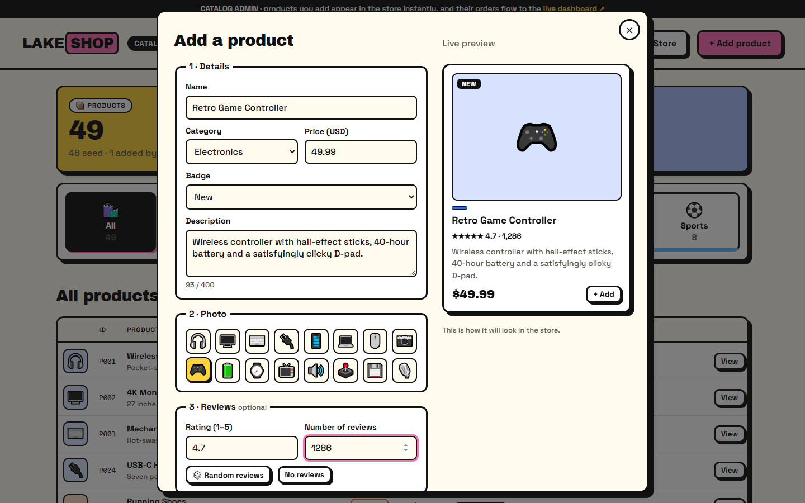 | 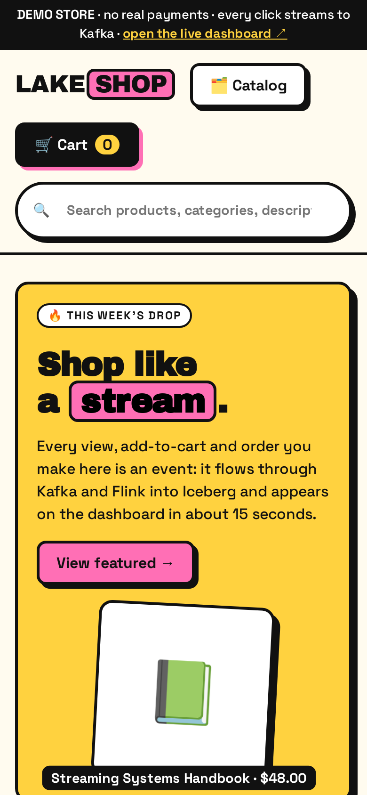 |

Regenerate them any time with `.venv/Scripts/python scripts/demo.py` (it sends real shopper traffic
through the store, then captures both apps).

---

## Why this project

Most streaming demos stop at "events go into Kafka". This one goes end to end, the way a
production streaming lakehouse works:

| Concern | How it's handled here |
|---|---|
| **Real events, not just a mock** | A storefront UI emits `page_view`, `add_to_cart` and `order` events; the server owns prices, ids and timestamps |
| **Event time, not arrival time** | Watermarks (`event_time - 5 s`) tolerate out-of-order events; the simulator deliberately produces them |
| **Exactly-once into the lake** | Flink checkpoints (10 s) drive atomic Iceberg commits: no duplicates, no partial files visible |
| **Streaming aggregations** | 1-minute tumbling windows with the window TVF API, executed as two-phase (local → global) aggregation |
| **Open table format** | Apache Iceberg v2 tables behind a REST catalog, Parquet + zstd, partitioned by day |
| **Engine interoperability** | Flink writes and Trino reads the **same** tables through the **same** catalog |
| **Lake maintenance** | Visible small-files problem, plus one-click `OPTIMIZE` compaction from the UI |
| **Time travel** | Query any table as of any snapshot (`FOR VERSION AS OF`) |
| **Operability** | Every chart shows its SQL and latency; Flink, Kafka, Trino and S3 UIs are all exposed |

---

## Architecture

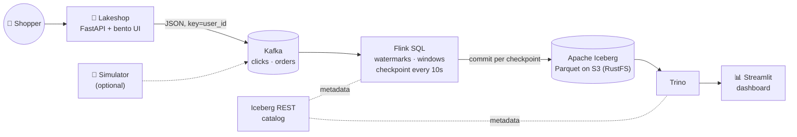

| Layer | Tech | Role |
|---|---|---|
| Produce | **FastAPI** + vanilla JS storefront | Real user events: product views, add-to-cart, checkout |
| Ingest | **Apache Kafka 3.9** (KRaft, no ZooKeeper) | Durable, partitioned event log (3 partitions per topic) |
| Process | **Apache Flink 1.20** (SQL) | Streaming ETL and windowed aggregation, exactly-once |
| Table format | **Apache Iceberg 1.8** (REST catalog on Postgres) | ACID tables, snapshots, schema evolution, time travel |
| Storage | **RustFS** (S3 API) | Object storage for Parquet data and Iceberg metadata |
| Query | **Trino 470** | Distributed SQL over Iceberg |
| Serve | **Streamlit** | Live dashboard, lakehouse explorer and SQL playground |

### Tables (medallion-style)

```
lakehouse.shop
├── clicks               bronze  raw page_view / add_to_cart events    PARTITIONED BY event_date
├── orders               bronze  raw orders                            PARTITIONED BY event_date
├── revenue_per_minute   gold    1-min tumbling window × category      orders, units, revenue
└── funnel_per_minute    gold    1-min tumbling window                 sessions, page views, carts
```

---

## Quick start

**Prerequisites:** Docker Desktop (or Docker Engine + Compose v2) with **≥ 6 GB of memory** allocated,
and free ports 8000, 8081, 8088, 8090, 8181, 8501, 9000, 9001 and 29092.

```bash
git clone https://github.com/<you>/realtime-ecommerce-lakehouse.git
cd realtime-ecommerce-lakehouse
docker compose up -d --build
```

The first build downloads ~1.5 GB of images. Then open the store at **http://localhost:8000** and the
dashboard at **http://localhost:8501** side by side, and go shopping.

Want the charts busy without clicking? Add simulated background traffic:

```bash
docker compose --profile simulator up -d
```

| When | What you'll see |
|---|---|
| ~1 min | Services healthy; the Flink job is submitted automatically |
| +10 s after your first click | First checkpoint → first Iceberg commit → KPIs appear |
| +~65 s | First 1-minute window closes → revenue chart appears |

Stop it with `docker compose down`, or wipe all data with `docker compose down -v`.

### All the UIs

| URL | What to look at |
|---|---|
| http://localhost:8000 | **Lakeshop**: the storefront that produces the events (test card `4242 4242 4242 4242`) |
| http://localhost:8000/admin.html | **Catalog admin**: list, search and add products (with an emoji picker) |
| http://localhost:8501 | **Dashboard**: live business view, lakehouse internals, SQL playground (`?theme=dark` for dark mode) |
| http://localhost:8081 | **Flink**: job graph, checkpoints (size and duration), backpressure, watermarks |
| http://localhost:8088 | **Kafka UI**: topics, partitions, consumer lag, live messages |
| http://localhost:8090 | **Trino**: query history and execution plans |
| http://localhost:9001 | **RustFS console**: browse the actual Parquet and metadata files (`admin` / `password`) |

---

## A guided tour (5 minutes)

1. **Lakeshop.** Search for "book", open a product (a `page_view`), add it to the cart (`add_to_cart`)
   and check out with the test card `4242 4242 4242 4242`. The **📡 Live events** tile counts what you
   sent, and you can watch the messages arrive in Kafka UI.
2. **Dashboard → 📈 Live Business.** About 15 s later your order is in the KPIs, the funnel and top
   products. Open any **🔍 SQL** expander to see the exact Trino query and how long it took.
3. **Flink UI → Running Jobs → ecommerce-lakehouse.** There's one job with four sinks. Notice:
   - both Kafka sources are **reused** across the raw and aggregated sinks (one read per topic);
   - windows run as `LocalWindowAggregate → GlobalWindowAggregate` (two-phase, which cuts shuffle volume);
   - **Checkpoints**: one completes every ~10 s, and each one is an Iceberg commit.
4. **Dashboard → 🔬 Lakehouse Internals.** Every checkpoint adds a snapshot and more small
   files. Press **🧹 Compact now**: Trino's `OPTIMIZE` rewrites them into fewer files while Flink keeps
   writing (Iceberg optimistic concurrency).
5. **Time travel.** Drag the snapshot slider to see the row count at any past commit.
6. **🧪 SQL Playground.** Try the *Cart abandonment by category* example, a join across two Iceberg
   tables written by a streaming job and read by a batch engine.
7. **RustFS console → `warehouse` bucket.** The lake is just files: `data/*.parquet` plus
   `metadata/*.json | *.avro`.

---

## How it works

### The storefront: [`shop/`](shop/)
A FastAPI app serves a no-build bento-grid UI (plain HTML/CSS/JS with native `<dialog>`s) and three endpoints:

| Endpoint | Emits | Notes |
|---|---|---|
| `GET /api/products` | – | The catalog: seed products from [`catalog/products.json`](catalog/products.json) plus admin-added ones |
| `POST /api/products` · `DELETE /api/products/{id}` | – | Add a product; delete an admin-added one (seed products are protected) |
| `POST /api/events` | `clicks` | `page_view` when a product opens, `add_to_cart` on add |
| `POST /api/checkout` | `orders` | Fake payment, then **one order event per cart line** (the grain of the `orders` table) |

**Catalog admin** (`/admin.html`, or the 🗂️ Catalog button): browse all products and **add new ones**
with a name, category, price, badge, description and an emoji "photo" from a per-category picker,
with a live preview, plus optional reviews (typed in, or 🎲 random). New products are buyable immediately, and their orders flow to the dashboard like
any other. The catalog lives in the shop's SQLite database (seeded from `catalog/products.json`, kept
in the `shop-data` volume), so added products survive restarts.

The browser only sends product ids and quantities, so **prices, totals, ids and timestamps are set on
the server** and a client can't tamper with them. Anonymous `user_id` (per browser) and `session_id`
(per tab) link a shopper's views, carts and orders, which makes the dashboard's funnel and
conversion rate real. Events use exactly the pipeline's JSON schema, so Flink needed no changes.

**Payments are fake by design.** Only published test numbers work (`4242…` approves; `…0002` and
`…9995` decline). Any other card number is refused, card fields opt out of browser autofill, and card
data is never stored, logged or sent to Kafka. UPI and cash on delivery are also simulated.

### Simulated traffic (optional): [`generator/generator.py`](generator/generator.py)
Enabled with `--profile simulator`. Each simulated session is a funnel: 1–5 page views, each with a 25 % chance of add-to-cart, and
each cart with a 40 % chance of becoming an order. Messages are **keyed by `user_id`**, so one user's
events land in the same partition in order. Event times are backdated up to 3 s, so arrival order ≠
event order. That's realistic, and it exercises the watermark. The Kafka producer runs with
`enable.idempotence=true` (no duplicates on retry) and zstd compression.

### Stream processing: [`flink/sql/pipeline.sql`](flink/sql/pipeline.sql)
- **Watermark** `event_time - INTERVAL '5' SECOND`: events up to 5 s late are still counted in their
  window. `table.exec.source.idle-timeout = 10 s` stops an idle partition from stalling the watermark.
- **Windows** use the window TVF `TUMBLE(TABLE ..., DESCRIPTOR(event_time), INTERVAL '1' MINUTE)`.
  Output is *append-only* (a window emits once when the watermark passes its end), which suits
  Iceberg's append commits.
- **`EXECUTE STATEMENT SET`** submits all four `INSERT`s as a single job, so sources are shared.
- **Offsets:** `scan.startup.mode = group-offsets` with `auto.offset.reset = earliest`. A resubmitted
  job resumes where the last checkpoint committed.
- **Idempotent deploy:** the one-shot `flink-job` container checks the Flink REST API and refuses to
  submit a second copy of the job, since two copies would write every event twice.

### Exactly-once into Iceberg
Each Flink `IcebergStreamWriter` writes Parquet files continuously. On a checkpoint barrier, it hands the
file list to a single `IcebergFilesCommitter`, which commits **one Iceberg snapshot** once the
checkpoint completes. Readers only ever see whole snapshots. Kafka offsets and Iceberg commits are tied
to the same checkpoint, so within a job's lifetime every event lands exactly once.

### Catalog and storage
The **Iceberg REST catalog** is the single source of truth for "which metadata file is current" for each
table. Flink and Trino both talk to it, which is why a table written by Flink is instantly queryable in
Trino. Data and metadata live in the `warehouse` bucket on **RustFS**, an S3-compatible server,
through Iceberg's native `S3FileIO` (no Hadoop filesystem involved).

### Serving: [`dashboard/app.py`](dashboard/app.py)
Streamlit runs every widget as a Trino query, with a neo-brutalist theme: flat colors, thick borders, and Altair charts on a colorblind-checked category palette. It has a dark mode (sidebar toggle, or open `http://localhost:8501/?theme=dark`). The live tab is a `st.fragment(run_every=…)`, so only
that section re-runs on refresh. Queries filter on `event_time`, and Iceberg's per-file min/max
statistics let Trino skip files outside the window.

---

## Configuration

| Setting | Where | Default |
|---|---|---|
| Traffic volume (sessions per second, ±50 % sine wave) | `SESSIONS_PER_SEC` env var | `20` (~6 orders/s) |
| Checkpoint interval (= lake freshness) | `pipeline.sql` → `execution.checkpointing.interval` | `10 s` |
| Allowed lateness | `pipeline.sql` → `WATERMARK … - INTERVAL '5' SECOND` | `5 s` |
| Flink parallelism and slots | `docker-compose.yml` → `FLINK_PROPERTIES` | `2` / `4` |

```bash
SESSIONS_PER_SEC=100 docker compose --profile simulator up -d generator   # 5x the simulated traffic
```

## Querying from your own tools

```bash
# Trino CLI inside the container
docker compose exec trino trino --catalog lakehouse --schema shop

# Kafka from the host
kafka-console-consumer --bootstrap-server localhost:29092 --topic orders
```

```sql
-- Snapshot history of a table (one row per Flink checkpoint)
SELECT committed_at, operation, element_at(summary, 'added-records') FROM "orders$snapshots" ORDER BY 1 DESC;

-- Time travel by timestamp
SELECT count(*) FROM orders FOR TIMESTAMP AS OF (current_timestamp - INTERVAL '5' MINUTE);

-- Compaction
ALTER TABLE orders EXECUTE optimize;
```

---

## Project structure

```
.
├── docker-compose.yml          # the whole platform: 10 services + 3 one-shot init jobs (+ optional simulator)
├── flink/
│   ├── Dockerfile              # Flink 1.20 + Kafka connector + Iceberg runtime + AWS bundle + Hadoop
│   └── sql/pipeline.sql        # ★ the streaming pipeline (sources, catalog, tables, inserts)
├── trino/
│   ├── catalog/lakehouse.properties   # Trino → Iceberg REST catalog + S3
│   └── jvm.config              # fixed 1 GB heap (prevents OOM-kill in a 1.5 GB container)
├── shop/
│   ├── main.py                 # API: catalog store (SQLite), click events, fake checkout -> Kafka
│   └── static/                 # bento UIs, no build step: store (index.html, app.js),
│                               #   catalog admin (admin.html, admin.js), common.js, styles.css
├── catalog/products.json       # 48 seed products, shared by shop and simulator
├── generator/
│   └── generator.py            # optional traffic simulator (--profile simulator)
├── dashboard/
│   └── app.py                  # Streamlit app
├── tests/                      # pytest suite: unit, contract, API, dashboard, browser e2e, integration
├── scripts/demo.py             # send shopper traffic through the store + capture screenshots
├── docs/                       # DEMO.md walkthrough, screenshots/, ai/ (PRD, Architecture, Rules, Design, Phases, Memory)
├── requirements-dev.txt        # test tooling
├── CLAUDE.md                   # context for AI coding assistants (incl. the mandatory testing workflow)
└── README.md
```

---

## Testing

```bash
python -m venv .venv
.venv/Scripts/python -m pip install -r requirements-dev.txt     # Linux/macOS: .venv/bin/python
.venv/Scripts/python -m pytest -rs
```

| Suite | What it proves |
|---|---|
| `test_catalog.py` | Catalog integrity; categories stay in sync across catalog, dashboard colors and store UI |
| `test_contract.py` | Shop and simulator events have exactly the columns Flink reads in `pipeline.sql` |
| `test_shop_api.py` | Every endpoint and payment method (card / UPI / COD), validation, price tampering, no card-data leaks |
| `test_catalog_api.py` | Adding, validating, persisting and deleting products; a new product can be bought |
| `test_generator.py` | Simulator funnel logic |
| `test_dashboard.py` | Dashboard run headless (Streamlit `AppTest`) against a fake Trino: KPIs, themes, SQL guard |
| `test_storefront_e2e.py` | A real browser (Playwright + Edge) shops: search, cart, every checkout, server-down handling, layout |
| `test_integration.py` | With `docker compose up`: a real order flows through Kafka → Flink → Iceberg and is queryable in Trino |

The integration tests skip when the stack isn't running. Start it first to verify the full pipeline.
Browser tests use the installed Edge; set `E2E_BROWSER=chromium` after `playwright install chromium`
to use Playwright's own Chromium instead.

## Design decisions and trade-offs

These are deliberate simplifications for a laptop demo, each with its production path:

| Choice here | Why | Production path |
|---|---|---|
| Flink checkpoints kept in JobManager memory | No shared filesystem needed between containers | S3 checkpoint storage + HA JobManager (Kubernetes operator) |
| Iceberg REST fixture (a test server) on Postgres | Standard REST API, small footprint | Polaris / Lakekeeper / Nessie / Glue |
| Single Kafka broker, RF=1 | Memory | 3+ brokers, RF=3, `min.insync.replicas=2` |
| Manual compaction button | Makes the small-files problem visible | Scheduled `rewrite_data_files` + `expire_snapshots` + `remove_orphan_files` |
| JSON on Kafka | Human-readable in Kafka UI | Avro / Protobuf + Schema Registry |
| Static demo credentials | Local only | Secrets manager, IAM roles |

## Troubleshooting

| Symptom | Cause / fix |
|---|---|
| Dashboard says "Waiting for data" for > 2 min | Check `docker compose logs flink-job` and the Flink UI → Exceptions tab |
| `port is already allocated` | Another app (often Airflow on 8080) holds a port. Change the host side of `ports:` in `docker-compose.yml` |
| Containers restart or Docker becomes unresponsive | Not enough memory. Give Docker ≥ 6 GB, stop other stacks, or remove `kafka-ui` |
| `CommitStateUnknownException` in the Flink UI | Catalog database errors. The catalog must run on Postgres (it did on SQLite once and crash-looped) |
| Latest minutes in the revenue chart look faded | Normal: those windows are still open (no newer events yet), so they're computed live from bronze and marked provisional |
| Trino exits with code 137 | OOM-kill. Keep `trino/jvm.config` (fixed heap) and `mem_limit` together |
| Changed `pipeline.sql` but nothing happens | The running job is kept. Cancel it in the Flink UI, then `docker compose run --rm flink-job` |
| Dashboard slowing down after an hour or two | Small files accumulate; press **🧹 Compact now** in the Internals tab |

## Roadmap ideas
- [ ] Schema Registry + Avro, with a schema-evolution demo (`ALTER TABLE … ADD COLUMN` mid-stream)
- [ ] Upsert (CDC) table: `customers` from Postgres via Flink CDC into an Iceberg v2 equality-delete table
- [ ] Late-event dead-letter side output + a dashboard counter
- [ ] Scheduled table maintenance (Airflow DAG)
- [ ] Data-quality checks (Great Expectations / Soda) on the gold tables
- [ ] Kubernetes deployment with the Flink operator

## Tech stack

`FastAPI` · `Apache Kafka 3.9` · `Apache Flink 1.20` · `Apache Iceberg 1.8.1` · `Trino 470` · `RustFS 1.0` · `Python 3.12` · `Streamlit 1.41` · `Docker Compose`

## License

[MIT](LICENSE) © 2026 Kaner Sharma
