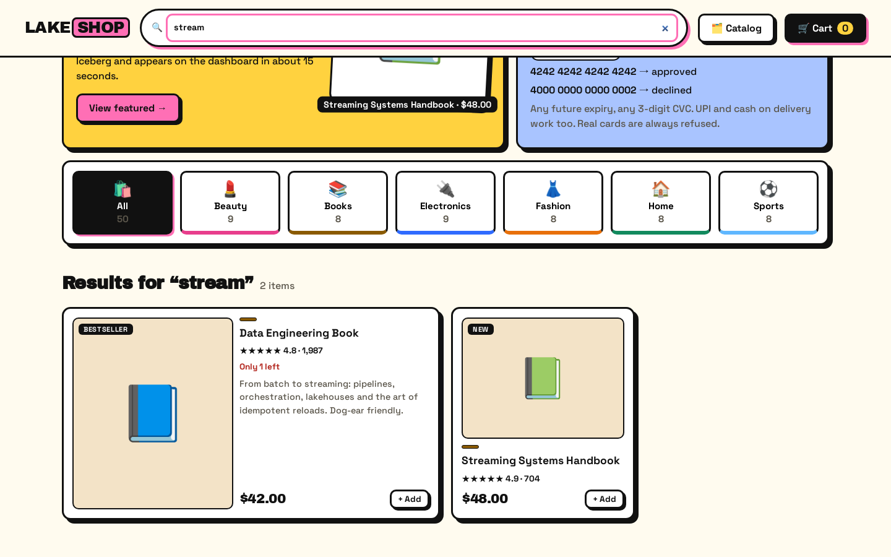
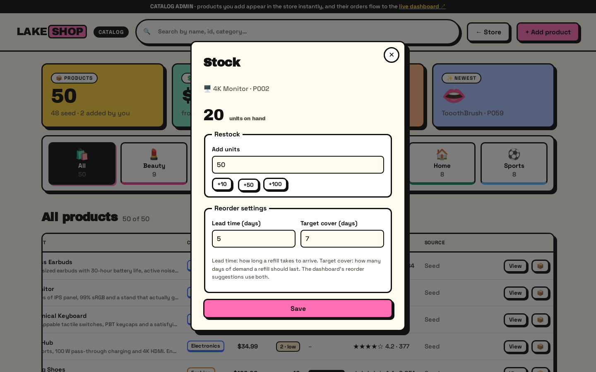
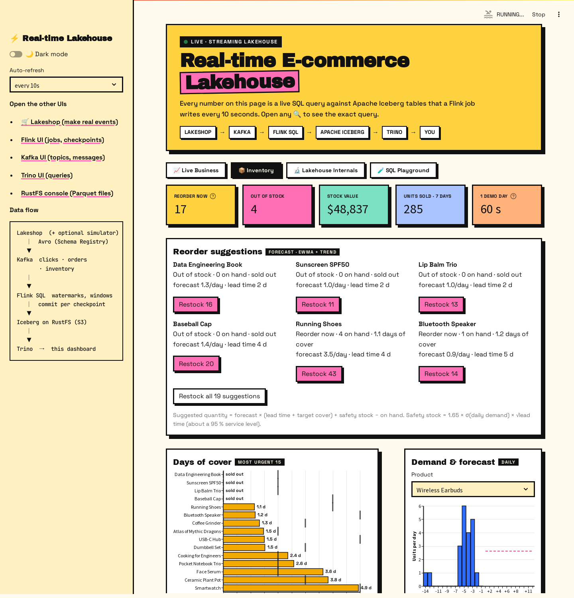
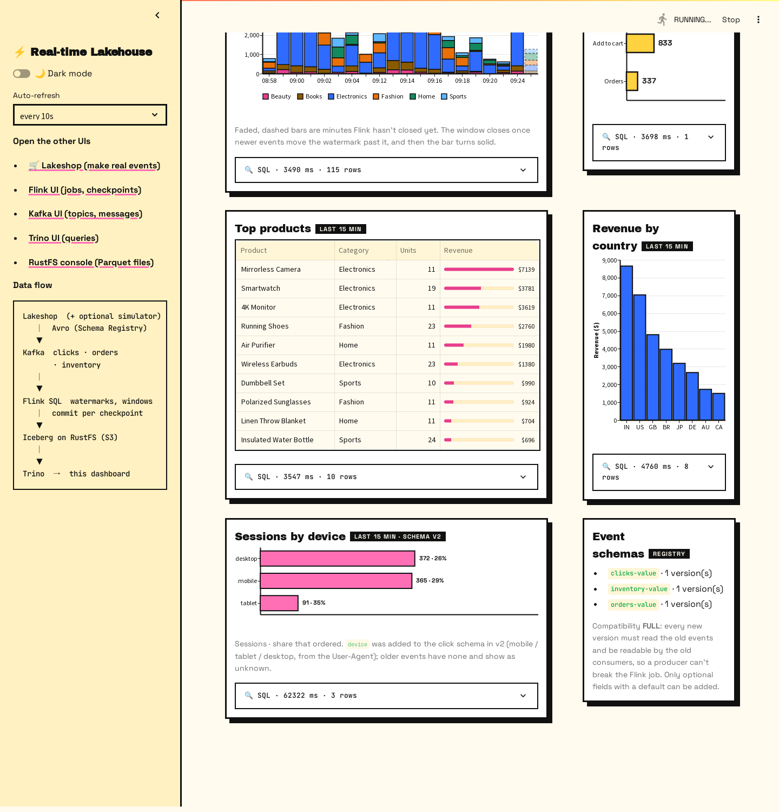

# 🎬 Demo guide

A 10-minute walkthrough for showing the project to someone: a team, a meetup, or yourself.
You shop in a real store, and seconds later the purchase shows up in a lakehouse dashboard.

## Before the demo (5 minutes)

```bash
docker compose up -d --build                    # start everything
docker compose run --rm demo --no-screenshots   # optional: 4 min of shopper traffic so charts are full
```

Open two browser windows side by side:

| Left | Right |
|---|---|
| 🛒 Lakeshop: http://localhost:8000 | 📊 Dashboard: http://localhost:8501 |

---

## 1 · The store is real


Lakeshop is a working storefront: search, categories, product pages, a cart and checkout. Every
action is an **event**. The green **📡 Live events** tile counts what this browser has sent to Kafka.


## 2 · Browse and search: `page_view` events



Type into the search bar, then open a product. Opening it sends a `page_view` event to the Kafka
topic `clicks`, keyed by the anonymous shopper id. The event is **Avro**, checked against the
registered `clicks` schema before it's sent, and the server adds your `device` from the browser's
User-Agent (open the store on your phone to see "mobile" appear).


## 3 · Add to cart: `add_to_cart` events


Each add sends an `add_to_cart` event. The cart survives a page reload, since it lives in local storage.

## 4 · Checkout with test payments


Try the declined test card `4000 0000 0000 0002` first: the payment fails and **no order event is
produced**. The same goes for asking for more than is in stock: the checkout is refused with
"Only N left of …", and nothing is emitted. Then press **Fill test card** (`4242 4242 4242 4242`), or choose UPI or cash on delivery.


The server prices the order from the catalog (the browser can't change prices) and emits **one
`orders` event per cart line**.

> Payments are fake. Only published test numbers work, and card details are never stored or sent anywhere.

## 4b · Add your own product


Press **🗂️ Catalog** in the store's top bar. You'll see all products with stats and filters. Press
**+ Add product**, give it a name, category, price and description, and pick an emoji "photo". The
preview shows exactly how the store will display it.


Save it, press **View** to jump to it in the store, and buy it. Its order reaches the dashboard like
any other, because it has the same event contract.

Every product has stock. Press **📦** on any row to restock it, or to change its lead time and target
cover, which drive the dashboard's reorder suggestions:



## 5 · Watch it land (about 15 seconds)


Within about one Flink checkpoint (10 s), your order is part of the KPIs, the funnel and top products.
Points worth mentioning:

- **Data freshness** shows the end-to-end latency: now minus the newest event in Iceberg.
- **Revenue per minute** comes from a *gold* table that Flink builds with 1-minute tumbling windows.
  A window closes once the watermark passes its end. In a quiet store that waits for the *next* event,
  so the latest minutes are shown **faded and dashed**, computed live from the raw orders until Flink
  closes them. A good question to ask the audience is why.
- Open any **🔍 SQL** to show the exact Trino query and its latency.

Dark mode is a toggle in the sidebar, or the link http://localhost:8501/?theme=dark:


## 6 · Inventory: from sales to reorder suggestions



Open **📦 Inventory** on the dashboard.

- The shop owns the stock. A checkout takes it inside one database transaction, so two shoppers can
  never both buy the last unit. Every stock change is also an `inventory` event, and Flink writes it
  to the Iceberg table `inventory_movements`.
- **Days of cover** puts each product's stock next to its lead time (the black tick). A bar shorter than
  its tick runs out before a refill ordered now could arrive.
- **Reorder suggestions** come from a forecast: an EWMA of daily sales plus the trend, a safety stock
  for volatile demand, then "order up to lead time + target cover". A demo day is 60 s, so a few
  minutes of traffic are two weeks of history.
- Press **Restock** on a suggestion. The dashboard calls the shop, and about 10 s later the new stock
  comes back through Kafka, Flink and Iceberg.
- A good question for the audience: a sold-out product sold nothing today, so why is its forecast not
  zero? (Nobody *could* buy it: the demand is censored, so the forecast uses the average instead.)

## 6b · Contracts: the Schema Registry and schema evolution



At the bottom of the Live tab, **Sessions by device** uses `device`, a field added in **v2** of the click
schema, and **Event schemas** lists what the registry holds. Points worth making:

- Every topic has an Avro schema (`schemas/*.avsc`) in a **Confluent Schema Registry** (Kafka UI →
  *Schema Registry*, or http://localhost:8085/subjects). Kafka UI decodes the binary messages with it.
- Compatibility is **FULL**: a new version must read old events and be readable by old consumers.
  Show the registry refusing a breaking change (dropping fields and adding a required `coupon`):

  ```bash
  curl -s -X POST localhost:8085/compatibility/subjects/clicks-value/versions/latest \
    -H "Content-Type: application/vnd.schemaregistry.v1+json" \
    -d '{"schema": "{\"type\":\"record\",\"name\":\"Click\",\"namespace\":\"lakeshop.events\",\"fields\":[{\"name\":\"event_id\",\"type\":\"string\"},{\"name\":\"coupon\",\"type\":\"string\"}]}"}'
  # {"is_compatible":false}
  ```
- `device` went in the safe way: optional in the schema, `ALTER TABLE clicks ADD COLUMN device` in
  Iceberg (metadata only, no file rewritten), then the Flink DDL. Old rows read NULL.


The SQL playground's *Schema evolution: clicks by device* example shows both generations side by side:
rows from before v2 (NULL device) and the new ones, in the same table, with no migration job.

## 7 · Under the hood: the lakehouse


- Every checkpoint is an **Iceberg snapshot**, which gives readers exactly-once data but lots of small files.
- Press **🧹 Compact now** to run Trino's `OPTIMIZE` while Flink keeps writing.
- Drag the **time travel** slider to query the table as it was at any earlier snapshot.

The SQL playground runs read-only SQL across tables that a streaming job wrote and a batch engine
reads. Try *Cart abandonment by category*, which joins `clicks` and `orders`.

## 8 · The mobile view


---

**Other UIs worth showing:** Flink job graph and checkpoints (http://localhost:8081), messages
arriving in Kafka and the registered schemas (http://localhost:8088), and the Parquet files in the RustFS console
(http://localhost:9001, `admin` / `password`).

To refresh these screenshots after a UI change: `docker compose run --rm demo` (rebuild the toolbox
first with `docker compose build tests`), or `.venv/Scripts/python scripts/demo.py` locally.
