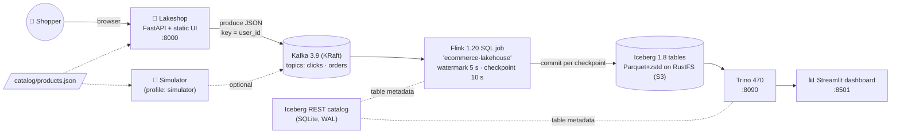

# Architecture

> How the system is built and why. Requirements are in [PRD.md](PRD.md), invariants in [Rules.md](Rules.md),
> and the history behind the odd-looking choices in [Memory.md](Memory.md).

## 1. System context



## 2. Components

| Service | Image / build | Host port | Role | Resources |
|---|---|---|---|---|
| `shop` | `./shop` (python:3.12-slim, FastAPI 0.115, uvicorn) | 8000 | Storefront UI + API, produces events | ~60 MB |
| `generator` | `./generator` | – | Optional simulator (`--profile simulator`) | ~15 MB |
| `kafka` | `apache/kafka:3.9.0` (KRaft) | 29092 (host listener) | Event log; in-network `kafka:9092` | heap 512 MB |
| `kafka-init` | `apache/kafka:3.9.0` | – | One-shot: creates `clicks`, `orders` (3 partitions, 24 h retention) | – |
| `kafka-ui` | `kafbat/kafka-ui:v1.1.0` | 8088 | Browse topics and messages | ~300 MB |
| `rustfs` | `rustfs/rustfs:1.0.0` | 9000 S3 / 9001 console | S3-compatible object store | ~150 MB |
| `s3-init` | `amazon/aws-cli:2.37.4` | – | One-shot: creates bucket `warehouse` | – |
| `iceberg-rest` | `apache/iceberg-rest-fixture:1.8.1` | 8181 | Iceberg REST catalog, JDBC on SQLite file | ~220 MB |
| `jobmanager` / `taskmanager` | `./flink` (`lakehouse-flink:1.20`) | 8081 | Flink cluster (parallelism 2, 4 slots) | 1024 MB / 1536 MB |
| `flink-job` | `./flink` | – | One-shot: submits `pipeline.sql` unless a job is already running | – |
| `trino` | `trinodb/trino:470` | 8090 → 8080 | SQL over Iceberg | limit 1536 MB, heap 1 GB |
| `dashboard` | `./dashboard` (Streamlit 1.41.1) | 8501 | Live dashboard | ~170 MB |

Volumes: `s3-data` (RustFS) and `catalog-data` (the REST catalog's SQLite). Kafka has no volume, so
`down` loses topics while Iceberg data survives. `down -v` wipes everything.

## 3. Request and event flow (checkout)

```mermaid
sequenceDiagram
    participant B as Browser (app.js)
    participant S as shop (main.py)
    participant K as Kafka
    participant F as Flink
    participant I as Iceberg (REST + S3)
    participant T as Trino
    participant D as Dashboard
    B->>S: POST /api/events {page_view, P021, user, session}
    S->>K: clicks ← {event_id, …, event_time (server UTC)}
    B->>S: POST /api/events {add_to_cart, P021}
    S->>K: clicks ← add_to_cart
    B->>S: POST /api/checkout {items:[{P021,3}], payment:{cod}}
    S->>S: authorize() → price lines from catalog
    S->>K: orders ← one event per line
    S-->>B: {order_ref, total, lines, paid_with}
    K->>F: consume (group-offsets, earliest)
    F->>I: write Parquet; on checkpoint complete → commit snapshot
    D->>T: SQL every 10 s
    T->>I: read current snapshot (REST catalog → S3)
    T-->>D: KPIs include the order (~10–15 s after checkout)
```

## 4. Event contract (the most important interface)
Defined by the Kafka source tables in [`flink/sql/pipeline.sql`](../../flink/sql/pipeline.sql). Producers
(`shop/main.py`, `generator/generator.py`) must emit **exactly** these fields, and `tests/test_contract.py`
enforces it.

**`clicks`**: `event_id` STRING · `session_id` STRING · `user_id` STRING · `event_type` STRING
(`page_view` | `add_to_cart`) · `product_id` STRING · `category` STRING · `event_time` TIMESTAMP(3)

**`orders`**: `order_id` · `session_id` · `user_id` · `product_id` · `product_name` · `category` ·
`quantity` INT · `unit_price` DECIMAL(10,2) · `total_amount` DECIMAL(12,2) · `country` ·
`payment_method` (`card` | `upi` | `cod` | `wallet`) · `event_time` TIMESTAMP(3)

- JSON over Kafka; the timestamp format is `yyyy-MM-dd HH:mm:ss.SSS` in **UTC, timezone-naive**.
- Message key = `user_id`, so one user's events stay ordered within a partition.
- Grain: one `orders` row per product line, not per checkout.
- IDs: browser ids match `^[A-Za-z0-9-]{6,64}$`; store users are `W-…`, sessions `S-…`; simulator
  users are `U00001…`.

## 5. Shop API

| Method | Path | Body | Success | Errors |
|---|---|---|---|---|
| GET | `/api/products` | – | 200: catalog array | – |
| POST | `/api/events` | `{event_type, product_id, user_id, session_id}` | 202 | 404 unknown product, 422 validation |
| POST | `/api/checkout` | `{user_id, session_id, name, country, items[{product_id, quantity 1–10}] (1–20), payment{method, card_number?, expiry?, cvc?, upi_id?}}` | 200: `{order_ref, total, lines, paid_with}` | 402 payment failed, 404 unknown product, 422 validation |
| GET | `/`, `/app.js`, `/styles.css` | – | static UI | – |

Validation is pydantic at the boundary. **All** lines are priced before **any** event is published, so
there are no partial orders. Without `KAFKA_BOOTSTRAP` the shop runs in *dry-run* mode and prints
events to stdout.

## 6. Flink job ([`pipeline.sql`](../../flink/sql/pipeline.sql))
- Sources: temporary Kafka tables `clicks_src` and `orders_src`, `json.ignore-parse-errors = true`,
  `scan.startup.mode = group-offsets` + `auto.offset.reset = earliest`,
  `WATERMARK event_time - 5 s`, `table.exec.source.idle-timeout = 10 s`.
- Catalog: `CREATE CATALOG lakehouse` (type iceberg, REST, S3FileIO → `http://rustfs:9000`).
- Sinks (all `IF NOT EXISTS`, format v2):

| Table | Layer | Partitioning | Written by |
|---|---|---|---|
| `lakehouse.shop.clicks` | bronze | `event_date` | passthrough + `CAST(event_time AS DATE)` |
| `lakehouse.shop.orders` | bronze | `event_date` | passthrough |
| `lakehouse.shop.revenue_per_minute` | gold | – | `TUMBLE(1 min)` by category: orders, units, revenue |
| `lakehouse.shop.funnel_per_minute` | gold | – | `TUMBLE(1 min)`: sessions, page_views, add_to_carts |

- A single `EXECUTE STATEMENT SET` means one job, reused sources, and two-phase (local/global)
  window aggregation.
- The job graph has 8 vertices: 2 sources, 2 global window aggregates and 4 Iceberg committers.

## 7. Exactly-once and freshness
Writers stream Parquet files. At each checkpoint barrier the file list goes to a single
`IcebergFilesCommitter`, which commits **one snapshot per table** once the checkpoint completes.
Readers see only whole snapshots. Kafka offsets are committed on the same checkpoint. Freshness is
therefore ≈ the checkpoint interval (10 s) plus commit time. Gold windows appear ≈ 65 s after a minute
starts (window end plus the 5 s watermark).

On idle checkpoints Flink commits **empty snapshots** (no `added-records` in `summary`). Readers must
tolerate that; see Rules R-SQL-1.

## 8. Dashboard internals
- `conn()` (cached Trino connection, session TZ = UTC), `query(sql) -> (DataFrame, ms)`, `show_sql`,
  and `code()` (a plain markdown fence, working around a Streamlit 1.41 `st.code` bug).
- The Live tab is an `st.fragment(run_every=refresh)`. Internals and Playground are separate fragments,
  so their buttons re-run only themselves.
- The theme comes from `?theme=` and becomes the `MODES` palette, CSS variables, Altair colours
  (`M["ink"]`, `CATS`). In dark mode the canvas data grids are inverted with a CSS filter.

## 9. Deliberate limits (with upgrade paths)
| Limit | Why | Production path |
|---|---|---|
| Flink checkpoints in JobManager memory | No shared FS between containers | S3 checkpoint storage + HA JobManager (K8s operator) |
| REST catalog on SQLite (WAL, 30 s busy timeout) | Zero extra services | Postgres JDBC catalog, or Polaris / Lakekeeper / Nessie |
| Single Kafka broker, RF = 1 | Memory | 3+ brokers, RF = 3, `min.insync.replicas = 2` |
| Manual compaction button | Makes the small-files problem visible | Scheduled `rewrite_data_files`, `expire_snapshots`, `remove_orphan_files` |
| JSON events | Human-readable in Kafka UI | Avro/Protobuf + Schema Registry |
| Static demo credentials | Local only | Secrets manager, IAM |
| Fake payments | Demo | A real PSP in its test mode |

## 10. Failure modes
| Symptom | Likely cause | Where to look |
|---|---|---|
| Store shows "Can't reach the Lakeshop server" | `shop` down or restarted under an open page | `docker compose ps shop` |
| Dashboard "Waiting for data" | No tables yet, or a failing query | Expand "Details"; Flink UI → Exceptions |
| Flink `restored` count keeps growing | Crash loop (catalog, S3, schema) | `curl localhost:8081/jobs/<jid>/exceptions` |
| `CommitStateUnknownException` + `SQLITE_BUSY` | Catalog lock contention | `CATALOG_URI` must keep WAL + busy_timeout |
| Trino exit 137 | OOM kill | `trino/jvm.config` heap vs `mem_limit` |
| Docker API returns 500 | VM out of memory (often another stack running) | `docker stats`; stop other stacks |

## 11. Repository map
```
shop/            main.py (API + pure logic), static/ (index.html, styles.css, app.js), Dockerfile
catalog/         products.json (shared catalog)
generator/       generator.py (optional simulator)
flink/           Dockerfile (connector jars), sql/pipeline.sql
trino/           catalog/lakehouse.properties, jvm.config
dashboard/       app.py, .streamlit/config.toml
tests/           pytest suite (see Rules R-TEST)
scripts/demo.py  traffic + screenshots
docs/            DEMO.md, screenshots/, ai/ (these docs)
```
